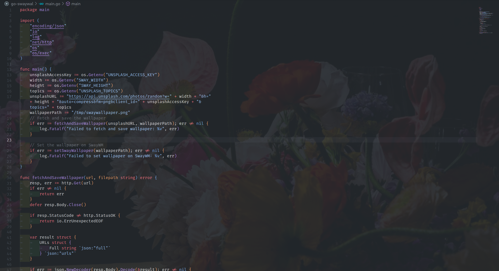

# go-swaywal

Simple Go command line tool that runs as cron job to change wallpaper on sway window manager by fetching images from Unsplash.  

Whether you're coding, browsing, or just enjoying your desktop, go-swaywal adds that extra bit of joy to your day with beautiful, dynamic backgrounds.  

[](./screenshot.png)

Supported wallpaper sources:

- Unsplash  
  Get your Unsplash API key from [here](https://unsplash.com/developers).

## Installation

1. Download the latest release from the [releases page](https://github.com/akhiljalagam/go-swaywal/releases).  
2. Run chmod +x on the binary and move it to /usr/local/bin.  

    ```sh
    chmod +x ~/Downloads/swaywal-linux-amd64
    sudo mv ~/Downloads/swaywal-linux-amd64 /usr/local/bin/swaywal
    ```

3. Add cron job to run the binary every 30 minutes or so. Update the environment variables with your values except SWAYSOCK, which is generated by the script. You may need to corrrect USER ID in the SWAYSOCK path.  

    ```sh
    * */30 * * * bash -c "SWAYSOCK=/run/user/1000/sway-ipc.1000.$(pgrep -x sway).sock UNSPLASH_ACCESS_KEY=<your-access-key> SWAY_WIDTH=3840 SWAY_HEIGHT=2160 UNSPLASH_SEARCH=nature /usr/local/bin/swaywal"
    ```

## Todo

- [ ] Add support for Bing, Reddit wallpaper.
